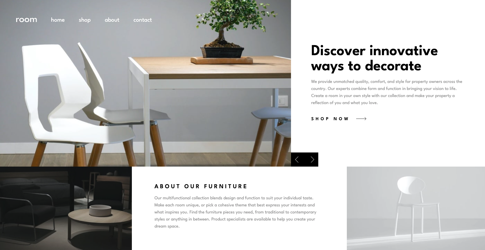

# Frontend Mentor - Room homepage solution

This is a solution to the [Room homepage challenge on Frontend Mentor](https://www.frontendmentor.io/challenges/room-homepage-BtdBY_ENq). 

## Table of contents

- [Frontend Mentor - Room homepage solution](#frontend-mentor---room-homepage-solution)
  - [Table of contents](#table-of-contents)
  - [Overview](#overview)
    - [The challenge](#the-challenge)
    - [Screenshot](#screenshot)
    - [Links](#links)
  - [My process](#my-process)
    - [Built with](#built-with)
    - [What I learned](#what-i-learned)
    - [Continued development](#continued-development)
    - [Useful resources](#useful-resources)
  - [Author](#author)

## Overview

### The challenge

To build a homepage for a website where users should be able to:

- View the optimal layout for the site depending on their device's screen size
- See hover states for all interactive elements on the page
- Navigate the slider using either their mouse/trackpad or keyboard

### Screenshot




### Links

- Solution URL: [Add solution URL here](https://github.com/aosull97/room-homepage.git)
- Live Site URL: [Add live site URL here](https://aosull97.github.io/room-homepage/)

## My process

### Built with

- React JS
- Vite
- Tailwind CSS

### What I learned

I learnt how to use a combination of useEffect and document.addEventListener to respond to user key presses:

```js
  useEffect(() => {
    const handleKeyDown = (e) => {
      if (e.key === "ArrowRight") {
        slideRight();
        console.log("right");
      } else if (e.key === "ArrowLeft") {
        slideLeft();
        console.log("left");
      }
    };
    document.addEventListener("keydown", handleKeyDown);
    return () => {
      document.removeEventListener("keydown", handleKeyDown);
    };
  });
```

### Continued development

Use this section to outline areas that you want to continue focusing on in future projects. These could be concepts you're still not completely comfortable with or techniques you found useful that you want to refine and perfect.

### Useful resources

- [Google Fonts](https://fonts.google.com/) - I could find the font requested in the design brief here.
- [Tailwind documentation](https://tailwindcss.com/docs/installation/using-vite) - I referred to this documentation when applying styling with Tailwind CSS. 
- [useKeyPress Guide](https://ryankubik.com/blog/use-key-press) - This blog helped me understand how to deal with keyboard events in React by using a combination of useEffect and document.addEventListener.


## Author

- Frontend Mentor - [@aosull97](https://www.frontendmentor.io/profile/aosull97)
- LinkedIn - [aliceosullivan97](www.linkedin.com/in/aliceosullivan97)


